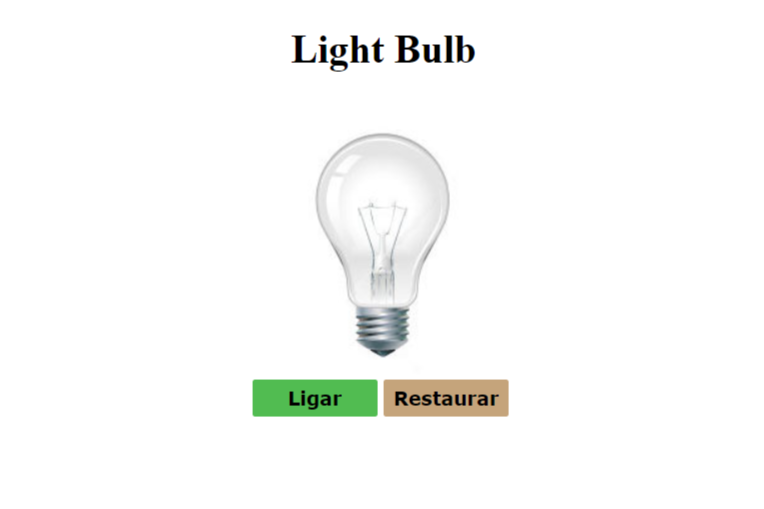
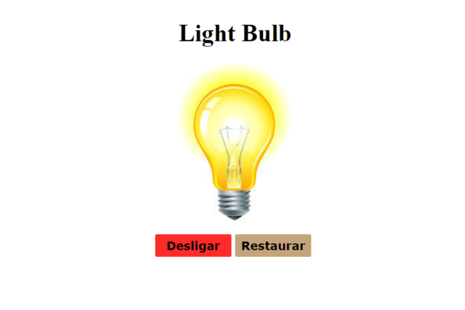
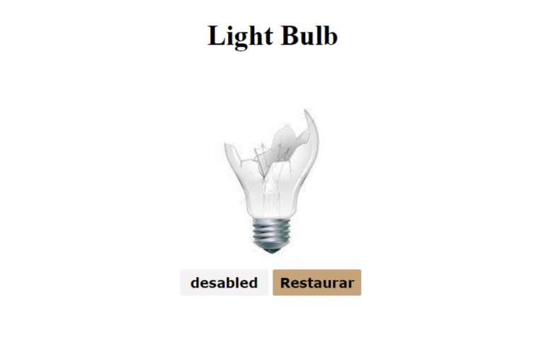

<h1>Light Bulb</h1>

 
 
 

 <h2>Sumário</h2>
 <ul>
   <li><a href="#proj">Projeto</a> 
       <li><a href="#desc">Descrição</a> 
 </ul> 

<h2 id="proj">Projeto</h2>

|  |  |
| ------------------------------------------------- | ---------------------------------------------- |
|  |                                              |

<h2 id="desc">Descrição</h2>

Este projeto representa o estado de uma lâmpada, onde eu posso 'ligar', 'desligar' ou com um double click na lampada, quebra-la, mas também posso restaura-la com o botão 'concertar'.

